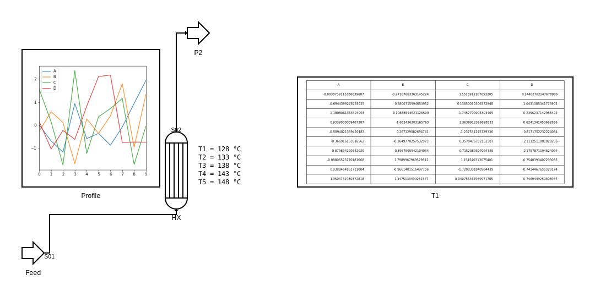

# Pyflowsheet Project

## Mission Statement
This project is a Python package that is intended to support engineers in creating simple process flow diagrams (PFD) from code, without the need for a complex chart drawing tool or CAD program.

The main use case is the visualization of flowsheets generated in textual modeling languages / process simulators and to present results in a graphical manner.

This package is not intended to replace CAD applications or to create printer-ready Process Flow Diagrams: this is a tool for a process engineer to support internal communication and process documentation.

## Project Status
This project is very young and in the unstable alpha Phase. The public interface of the API and the function definitions may change with every release. Please treat every release as a change in the Major version, even though the major version will not change to 1 until a stable development pace has been reached.

The documentation is just being set up, and will be gradually completed as more and more functions stabilize. 

**Remark:**

     The routing is done via the Dijkstra algorithm as implemented in the pathfinding library, with a very simple heuristic to discourage turning/staircasing. This may not always work and produce nice-looking streams. If you need more control over the stream routing, pyflowsheet provides a manual override of the corner points of the stream path.

## How to install

```pip install pyflowsheet```

If you want to install the optional dependency Matplotlib you can instead install the [plots] extra requirement.

```pip install pyflowsheet[plots]```

### Dependencies
* [svgwrite](https://github.com/mozman/svgwrite) 
* [python-pathfinding package](https://github.com/brean/python-pathfinding)
* Pillow (optional)
* Matplotlib (optional)
* Pandas (optional)

# Examples

## Supported flowsheet elements
* Stream Flag/Off-page connector
* Mixer/Splitter
* Black-Box Operation/Process Step
* Vessel (horizontal/vertical, internals can be ["tubes","bed"])
* Valve
* Distillation Column
* Pump

The following annotation objects are available:
* Callout (simple text element)
* Figure (requires matplotlib)
* Table (requires matplotlib)

## Units of measure and the grid

The flowsheet will be rasterized in a 10 by 10 grid for routing the streams. The user can choose any units/sizes for his unit operations, but some sizes are fixed.
* Stream arrowheads
* Grid size

Connectors are always defined using the relative position with regard to the containing unit operation. (0,0) means the connectors will be drawn at the top left corner. 

The default sizes for each unit assume multiples of 20, so that connectors lie exactly on the grid.

## How to draw simple block flow diagrams
In this example it is shown how the pyflowsheet package can be used to draw block flow diagrams, an even simpler form of process documentation than PFDs.

```python
from pyflowsheet import Flowsheet, BlackBox, Stream, StreamFlag, Port, SvgContext,VerticalLabelAlignment, HorizontalLabelAlignment
from IPython.core.display import SVG, HTML

pfd= Flowsheet("V100","Block Flow Diagram", "Demo Flowsheet for showing block-flow diagram style")

SP1=BlackBox("Pretreatment","Removal of catalyst poisons", position=(100,180), size=(80,60))
SP2=BlackBox("Reaction","Catalytic reaction", position=(240,180), size=(80,60))
SP3=BlackBox("Gas-Recovery","Recycling of unconverted gaseous feedstock", position=(380,180), size=(80,60))
SP4=BlackBox("Separation","Recycling of solvent", position=(520,180), size=(80,60))
SP5=BlackBox("Purification","Removal of side product", position=(660,180), size=(80,60))

Feed= StreamFlag("Feed", "", position=(0,190))
Product= StreamFlag("Product", "", position=(800,190))
Waste= StreamFlag("Waste", "", position=(120,360))
SideProduct= StreamFlag("SideProduct", "", position=(680,360))

steps=[SP1,SP2,SP3,SP4,SP5]

for sp in steps:
    sp.setTextAnchor(HorizontalLabelAlignment.Center,VerticalLabelAlignment.Center,(0,5) )

Waste.rotate(90)
SideProduct.rotate(90)

#Add additional ports to the process steps for recycles and removal of unwanted components
SP1.ports["Out2"] = Port("Out2", SP1, (0.5, 1), (0, 1), intent="out")
SP5.ports["Out2"] = Port("Out2", SP5, (0.5, 1), (0, 1), intent="out")
SP3.ports["Out2"] = Port("Out2", SP3, (0.5, 0), (0, -1), intent="out")
SP4.ports["Out2"] = Port("Out2", SP4, (0.5, 1), (0, 1), intent="out")
SP2.ports["In2"] = Port("In2", SP2, (0.5, 0), (0, -1))
SP2.ports["In3"] = Port("In3", SP2, (0.5, 1), (0, 1))

#Add all units to the diagram
pfd.addUnits( [Feed,Product,Waste, SideProduct, SP1,SP2, SP3, SP4, SP5] )

#Create stream connectivity
pfd.connect("S01", Feed["Out"], SP1["In"] ) 
pfd.connect("S02", SP1["Out"], SP2["In"] ) 
pfd.connect("S03", SP2["Out"], SP3["In"] ) 
pfd.connect("S04", SP3["Out"], SP4["In"] ) 
pfd.connect("S05", SP4["Out"], SP5["In"] ) 
pfd.connect("S06", SP5["Out"], Product["In"] ) 
pfd.connect("S07", SP1["Out2"], Waste["In"] ) 
pfd.connect("S08", SP5["Out2"], SideProduct["In"] ) 
pfd.connect("S09", SP3["Out2"], SP2["In2"] ) 
pfd.connect("S10", SP4["Out2"], SP2["In3"] ) 

#Change the label offset for stream S09 to make it more readable
pfd.streams["S09"].labelOffset=(0,-5)

#Create a rendering context for the flowsheet and display it. pfd.draw(ctx) will also save the file to disc.
ctx= SvgContext("img/blockflowprocess.svg")
img = pfd.draw(ctx)
SVG(img.render(scale=1))
```


## A distillation tower with externalized units
In the pyflowsheet package, you have the option to draw distillation towers with simplified peripherals (condenser and reboiler) in one icon, or you can define the periphery in more detail with individual unit operations.

```python
from pyflowsheet import Flowsheet, UnitOperation, Distillation, Vessel, BlackBox, Pump, Stream, StreamFlag, Valve,HeatExchanger, Mixer, Splitter, Port,BitmapContext, SvgContext
from IPython.core.display import SVG, HTML
from pyflowsheet import VerticalLabelAlignment, HorizontalLabelAlignment

pfd= Flowsheet("V100-DS10","Complex Distillation", "Demo Flowsheet for testing externalized columns peripherals and routing")

Feed= StreamFlag("Feed", "Feed", position=(0,250))
HX1=HeatExchanger("Preheater","Pre-Heater", position=(160,250))
TWR1=Distillation("Tower","Distillation Tower", hasCondenser=False, hasReboiler=False,position=(300,120), size=(40,300), internals="packing")
MX1= Mixer("MX1", "Mixer", position=(400,450))
SP1= Splitter("SP1", "Splitter", position=(460,450))
REB=Vessel("Reboiler","Falling Film Evaporator", position=(390,340), size=(40,80),capLength=20,internals="Tubes")
REB.ports["Out2"] = Port("Out2", REB, (0, .25), (-1, 0), intent="out")
COND=Vessel("Condenser","Condenser", position=(390,40), orientation="horizontal", size=(100,40), internals="tubes")
COND.ports["Out2"] = Port("Out2", COND, (0.85, 0), (0, -1), intent="out")
SP2= Splitter("SP2", "Reflux-Splitter", position=(500,130))
P1= StreamFlag("P1", "Product 1", position=(560,120))
P2= StreamFlag("P2", "Product 2", position=(0,400))
P3= StreamFlag("P3", "Product 3", position=(560,0))

#rotate units to resemble the actual plant layout
COND.rotate(15)
SP2.rotate(90)
P2.flip(axis="horizontal")
REB.flip(axis="vertical")

pfd.addUnits( [Feed,HX1,TWR1,MX1, SP1, REB,COND,SP2, P1,P2,P3] )

pfd.connect("S01", Feed["Out"], HX1["TIn"] ) 
pfd.connect("S02", HX1["TOut"], TWR1["Feed"] ) 
pfd.connect("S04", TWR1["LOut"], MX1["In1"] ) 
pfd.connect("S05", HX1["SOut"], P2["In"] ) 
pfd.connect("S06", MX1["Out"], SP1["In"] ) 
pfd.connect("S08", SP1["Out2"], REB["In"] ) 
pfd.connect("S09", REB["Out"], MX1["In2"] ) 
pfd.connect("S10", REB["Out2"], TWR1["VIn"] ) 
pfd.connect("S11", TWR1["VOut"], COND["In"] ) 
pfd.connect("S12", COND["Out"], SP2["In"] )
pfd.connect("S13", SP2["Out2"], P1["In"] ) 
pfd.connect("S14", SP2["Out3"], TWR1["RIn"] ) 
pfd.connect("S15", COND["Out2"], P3["In"] )
pfd.connect("S07", SP1["Out1"], HX1["SIn"] ) 

#If you do not like the automatic stream layout, you can manually define a sequence of relative steps (relative to last point). The first element is the difference in x direction, the second element is the difference in y. The route starts at the source connector.

pfd.streams["S07"].manualRouting=[(14,0),(0,30),(-240,0),(0,-260),(-70,0)] 
pfd.streams["S05"].labelOffset=(10,30)
pfd.streams["S07"].labelOffset=(25,10)
pfd.streams["S15"].labelOffset=(10,-10)
pfd.streams["S11"].labelOffset=(10,-10)

#Change the label positions to make them more readable
TWR1.setTextAnchor(HorizontalLabelAlignment.RightOuter,VerticalLabelAlignment.Center,(10,0) )
REB.setTextAnchor(HorizontalLabelAlignment.RightOuter,VerticalLabelAlignment.Center,(10,0) )

ctx= SvgContext("img/externalized_column_with_preheater.svg")
img = pfd.draw(ctx)
SVG(img.render(scale=1))
```


## Showing results
You can embed matplotlib plots and pandas tables into the SVG graphic with the help of Plot and Table annotations.

**Remark:** If you want to use this feature, you have to install pandas and matplotlib on your system. These are not listed as actual dependencies of pyflowsheet and will not be installed automatically. If those packages are not present on your system, importing the Figure and Table element will warn you about this fact.

```python
from pyflowsheet import Flowsheet, UnitOperation, Distillation, Vessel, BlackBox, Pump, Stream, StreamFlag, Valve,HeatExchanger, SvgContext, Table, Figure, TextElement
from IPython.core.display import SVG, HTML

import matplotlib.pyplot as plt
import pandas as pd
import numpy as np

#Turn the interactive plotting option off to prohibit the plot to be shown twice
plt.ioff()

pfd= Flowsheet("V100-DS20","Simple Distillation", "Demo Flowsheet for testing functionality")

Feed= StreamFlag("Feed", "Feed", position=(0,400))
HX=Vessel("HX","Condenser", position=(260,200), orientation="vertical", size=(40,140), internals="tubes")
P2= StreamFlag("P2", "Product 2", position=(300,000))

pfd.addUnits( [Feed,HX,P2] )
pfd.connect("S01", Feed["Out"], HX["In"] ) 
pfd.connect("S02", HX["Out"], P2["In"] ) 

#Create your pandas dataframe
df = pd.DataFrame(np.random.randn(10, 4), columns=list('ABCD'))

#Create a new table object and pass the pandas table as the data argument. It will internally be rendered as a  matplotlib Table
T1 = Table("T1", "DemoTable", data=df, position=(500,100), size=(500,200),figsize=(12,5))

#Create your plot. Pass it to the Figure annotation. Pass the figure object as the fig parameter. It will internally be rendered into a base64 encoded string and embedded into the SVG drawing.
fig=df.plot(kind="line",figsize=(5,5))
F1 = Figure("Profile", "DemoFigure", fig=plt.gcf(), position=(00,50), size=(250,250))

#You can also create very simple tables on your own by creating callouts. In a real application the numbers would of course come from a real data source (simulation or plant data)
for i in range(1,6):
    pfd.callout(f"T{i} = {123+5*i} °C", (320,220+15*i) )

pfd.addAnnotations([F1,T1])

ctx= SvgContext("img/plots_and_tables.svg")
img = pfd.draw(ctx)
SVG(img.render(scale=1))  
```


# License
MIT License

Copyright (c) 2020 Jochen Steimel

Permission is hereby granted, free of charge, to any person obtaining a copy
of this software and associated documentation files (the "Software"), to deal
in the Software without restriction, including without limitation the rights
to use, copy, modify, merge, publish, distribute, sublicense, and/or sell
copies of the Software, and to permit persons to whom the Software is
furnished to do so, subject to the following conditions:

The above copyright notice and this permission notice shall be included in all
copies or substantial portions of the Software.

THE SOFTWARE IS PROVIDED "AS IS", WITHOUT WARRANTY OF ANY KIND, EXPRESS OR
IMPLIED, INCLUDING BUT NOT LIMITED TO THE WARRANTIES OF MERCHANTABILITY,
FITNESS FOR A PARTICULAR PURPOSE AND NONINFRINGEMENT. IN NO EVENT SHALL THE
AUTHORS OR COPYRIGHT HOLDERS BE LIABLE FOR ANY CLAIM, DAMAGES OR OTHER
LIABILITY, WHETHER IN AN ACTION OF CONTRACT, TORT OR OTHERWISE, ARISING FROM,
OUT OF OR IN CONNECTION WITH THE SOFTWARE OR THE USE OR OTHER DEALINGS IN THE
SOFTWARE.

